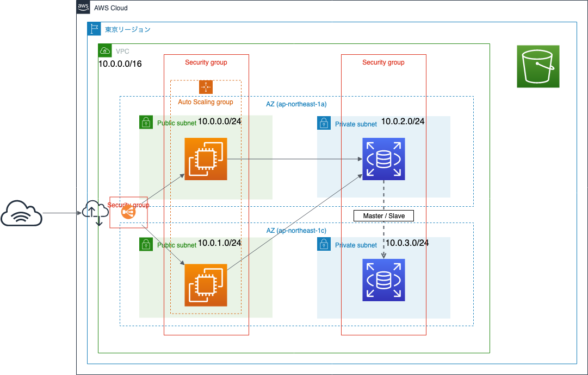
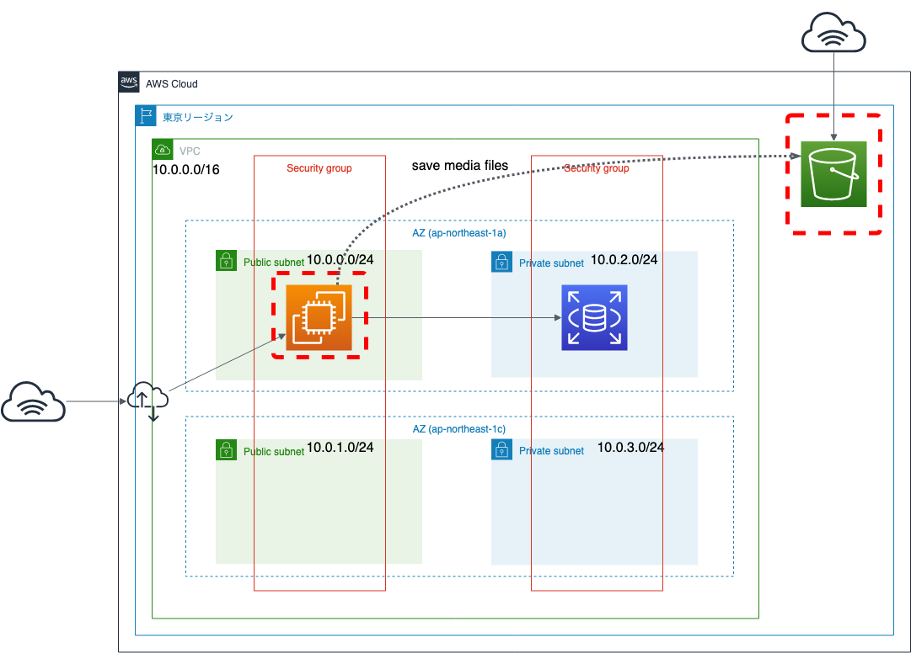
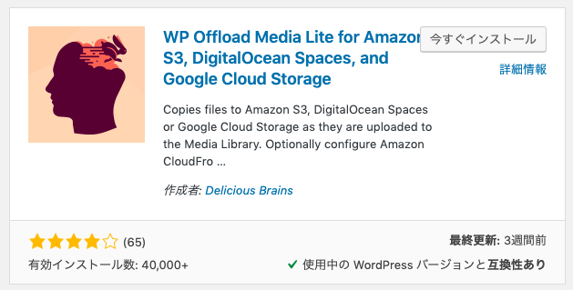
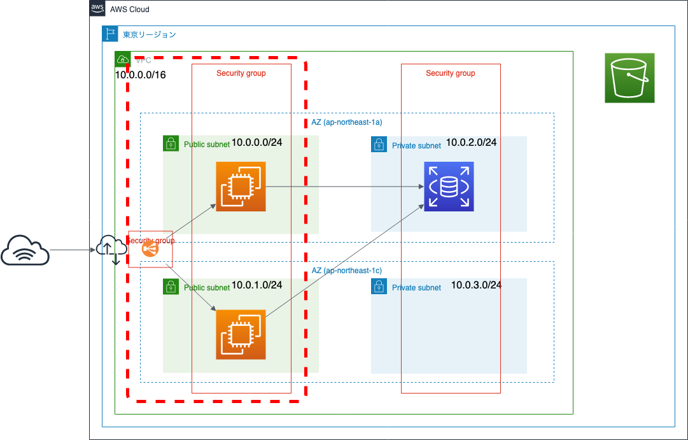
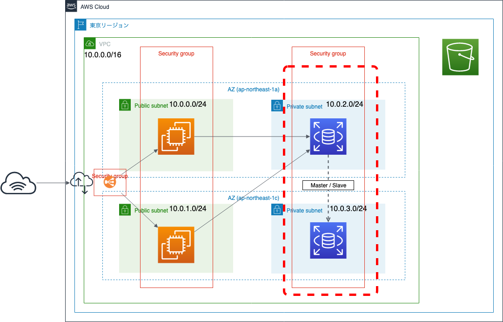
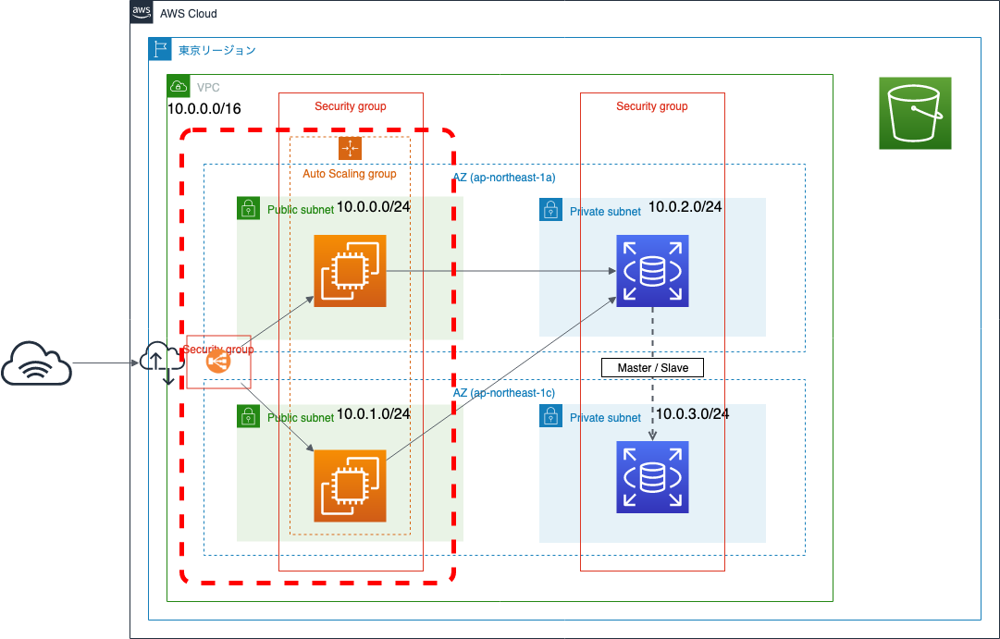

# Amazon EC2で可用性を考慮してWordPressサイトを構築するには

## 概要

このハンズオンでは、
Amazon EC2の可用性を考慮したWordPressサイトの構築を、
AWSマネジメントコンソールを通して設定します。

この章では、前章のEC2ハンズオンで構成したWordPressサイト環境を元に行うので、
前章のハンズオンを行なっていない方は事前に構築してください。

## 目的

このハンズオンでは、以下のことを行います。

- WordPressのメデイアファイルをS3に配置し、S3からメディアファイルを配信する
- ロードバランサーを設置し、EC2へのアクセスを負荷分散させる (オプション)
- RDSをマルチAZ構成にする (オプション)
- EC2にスケーラビリティを追加する (オプション)

なお、本章での作業は無料利用枠の範囲外のものもありますので、
利用料に注意して実施してください。

## 全体図



## AWSマネジメントコンソールにアクセスする

1. [AWSのWebサイト](https://aws.amazon.com/jp/)にアクセスし、
    サイト右上にある「コンソールへログイン」をクリックします。
2. ログイン画面です。IAMユーザは「アカウント」には「アカウントID」を入れ、ユーザとパスワードにはIAMユーザのユーザ名とパスワードを入力します。
    ルートアカウントは、ユーザ名にルートアカウントのメールアドレスを入れ、パスワードにはルートアカウントのパスワードを入れます。
    必要事項を入力したら、「サインイン」をクリックします。
    - 多要素認証が有効な場合は、次の画面で認証トークンを入力します。
3. AWSマネジメントコンソールのトップページが開いたら完了です。

## 作業1: WordPressの画像ファイルをS3に配置し、S3から画像ファイルを配信する

WordPressは画像ファイル、動画ファイルなどのメディアファイルをつけてブログ投稿できますが、
その際のメディアファイルはEC2インスタンス上に保存されます。

EC2インスタンスが壊れて起動できなくなった場合やインスタンス削除した場合、
データはRDSに保存されていますが、メディアファイルは消えてしまいます。

また、WordPressサイトが起動するEC2インスタンスを複数台起動している場合、
どこかのEC2インスタンスに保存されたメディアファイルを
各EC2インスタンスにファイル同期しなければならず、
運用メンテナンスが大変です。

そこで、メディアファイルをAmazon S3に保存し、
S3から直接メディアファイルを配信することで、この問題を回避したいと思います。



### 1-1. IAMロールの作成とEC2への権限付与

まず、WordPressが起動するEC2からS3にアクセスできるように、
IAMロールを使って権限を付与します。

    ※ すでにEC2にSSMの権限を付与するロールを割り当てている場合は、以下の手順ではなく、既存のロールに "AmazonS3FullAccess" ポリシーを追加でアタッチする手順になります。

1. AWSマネジメントコンソールで右側に「東京」と表示されているか確認します。
    - 別のリージョン名が表示されていない場合は、リージョン名をクリックし「アジアパシフィック (東京)」を選択します。
2. AWSマネジメントコンソールで「サービス」から「IAM」をクリックします。
    - IAMダッシュボード画面が表示されます。
3. 左側メニューの「ロール」をクリックし、「ロールの作成」をクリックします。
4. 以下の設定をして、「次のステップ: アクセス権限」をクリックします。
    - 信頼されたエンティティの種類を選択: 「AWSサービス」を選択
    - このロールを使用するサービスを選択: 「EC2」を選択
5. 以下の設定をして、「次のステップ: タグ」をクリックします。
    - ポリシー一覧の中から、「AmazonS3FullAccess」を選択
        - 検索テキストボックスに「S3」と入力すると一覧が絞られます。
6. タグは空欄のままで構わないので、「次のステップ: 確認」をクリックします。
7. 以下の設定をして、「ロールの作成」をクリックします。
    - ロール名: RoleJawsugNiigataHandson20190525
8. ロールの一覧に作成したロールがあればOKです。
9. AWSマネジメントコンソールで「サービス」から「EC2」をクリックします。
    - EC2ダッシュボード画面が表示されます。
10. 左側メニューの「インスタンス」をクリックします。
11. インスタンス一覧の中からWordPressが起動しているEC2インスタンスを選択し、
    「アクション」⇒「インスタンスの設定」⇒「IAMロールの割り当て/置換」をクリックします。
12. 先ほど作成したIAMロールを選択し、「適用」をクリックします。
    - 「IAM ロールオペレーションに成功しました」と表示されればOKです。

### 1-2. S3バケットの作成

次に、S3にファイルを保存する場所である「バケット」も作成します。
また、S3にパブリックアクセス設定ができる状態にしておきます。
オブジェクトを公開する設定自体は、WordPressプラグインが行ってくれます。

1. AWSマネジメントコンソールで「サービス」から「S3」をクリックします。
    - S3バケット一覧画面が表示されます。
2. 「バケットを作成する」をクリックします。
3. 以下の内容を設定して、「作成」をクリックします。
    - バケット名: jawsug-niigata-20190525-NUMBER
        - NUMBERを適当なランダムな番号に置き換えてください。
            バケット名は、全世界で一意になる必要があります。
    - リージョン: アジアパシフィック (東京)
4. S3バケット一覧に、先ほど作成したバケットが表示されていればOKです。
    - "The requested bucket name is not available"で始まるエラーが表示された場合は、すでに同じバケット名が世の中に存在していることを示しています。最初の「Edit」リンクをクリックしてバケット名を変更して再度作成してください。
5. 作成したバケット名をクリックします。
6. 「アクセス権限」タブをクリックします。
7. 「ブロックパブリックアクセス」を確認します。
    - 「パブリックアクセスをすべてブロック」が「オン」になっていると思います。
8. 「編集」をクリックします。
9. 「パブリックアクセスをすべてブロック」のチェックを外して、「保存」をクリックします。
10. テキストフィールドに「確認」と入力して、「確認」をクリックします。
    - 「パブリックアクセス設定が正常に更新されました」を表示されればOKです。

### 1-3. WordPressプラグインの導入

最後に、WordPressのプラグインを導入し、
メディアファイルを保存する先をS3にしたり、
メディアファイルを表示する際にS3のURLにしたりできるようにします。

- 参考: [WordPressの画像ファイルをS3に保存する(メディア機能連携) | つかびーの技術日記](http://tech-blog.tsukaby.com/archives/972)
- 参考: [WP Offload Media Lite for Amazon S3, DigitalOcean Spaces, and Google Cloud Storage - WordPress plugin | WordPress.org](https://wordpress.org/plugins/amazon-s3-and-cloudfront/)

1. Webブラウザで`http://<パブリックDNS名>/wp-login.php`にアクセスします。
2. 以下のように入力してログインします。
    - Username: user
    - Password: WordPressの管理者パスワード
3. WordPress管理画面の左側メニューから「プラグイン」をクリックし、「新規追加」をクリックします。
4. プラグイン検索に「s3」と入力してプラグインを検索し、
    その中で「WP Offload Media Lite for Amazon S3, DigitalOcean Spaces, and Google Cloud Storage」を探し、「今すぐインストール」をクリックします。
    - 
5. インストール完了後、「有効化」をクリックします。
6. プラグイン一覧が表示されるので、その中から「WP Offload Media Lite」の
    「Settings」をクリックします。
7. 以下の設定をして、「Next」をクリックします。
    - 「Amazon S3」を選択
    - 「My Server is on Amazon Web Services and I'd like to use IAM Roles」を選択
8. `wp-config.php`に以下の1行を追記する旨が記述されているので、以下の1行をコピーしておく。
    ```php
    define( 'AS3CF_AWS_USE_EC2_IAM_ROLE', true );
    ```
9. SSHでWordPressが起動しているEC2インスタンスにログインし、
    以下のコマンドを入力して、`wp-config.php`に先ほどコピーした1行を追記する。
    ```bash
    vi ~/apps/wordpress/htdocs/wp-config.php
    ```
    - 以下の1行を追記
    ```php
    /** DB設定の前に、追記しておくことにする **/
    define( 'AS3CF_AWS_USE_EC2_IAM_ROLE', true );
    ```
10. WordPress管理画面に戻り、先ほどのプラグインの設定画面を再度開く。
11. 「What bucket would you like to use?」と表示されているので、
    以下の設定をして、「Save Backet Setting」をクリックします。
    - Bucket: 先ほど作成したS3バケット名
12. 「設定を保存しました。」と表示され、「URL PREVIEW」にs3へのURLが記述されていればOKです。
13. WordPressの新規投稿をして、その際に適宜画像ファイルを一緒に投稿してみましょう。
    - 画像ファイルがS3にアップロードされ、画像ファイルのURLがS3へのURLになっていることを確認できればOKです。

## 作業2: ロードバランサーを設置し、EC2へのアクセスを負荷分散させる (オプション)



### 2-1. WordPressが起動するEC2インスタンスのAMIを作成する

はじめに、既存のWordPressが起動するEC2を元に、仮想マシンイメージ (AMI) を作成しましょう。

1. AWSマネジメントコンソールで右側に「東京」と表示されているか確認します。
    - 別のリージョン名が表示されていない場合は、リージョン名をクリックし「アジアパシフィック (東京)」を選択します。
2. AWSマネジメントコンソールで「サービス」から「EC2」をクリックします。
    - EC2ダッシュボード画面が表示されます。
3. 左側メニューの「インスタンス」をクリックします。
4. WordPressが起動しているEC2インスタンスを選択し、
    「アクション」⇒「イメージ」⇒「イメージの作成」をクリックします。
5. 以下の項目を設定し、「イメージの作成」をクリックします。
    - イメージ名: wordpress-jawsug-niigata-handson-20190525
6. 「イメージの作成リクエストを受け取りました」と表示されたらOKです
    - 「閉じる」をクリックしましょう。

### 2-2. 別AZに2台目のEC2インスタンスを作成する

次に、作成したAMIを使って2台目のEC2インスタンスを作成します。

1. EC2の左側メニューから「AMI」をクリックします。
2. 作成したAMIのステータスが「available」になっていることを確認します。
    - ステータスが「panding」であれば、しばらく待ちます。
3. 作成したAMIを選択し、「起動」をクリックします。
4. インスタンスタイプは「t2.micro」が選択されていることを確認し、
    「次の手順: インスタンスの詳細の設定」をクリックします。
5. インスタンス詳細設定を以下のようにし、「次の手順: ストレージの追加」をクリックします。
    - ネットワーク: jawsug-niigata-handson-20190525
    - サブネット: pub2-jawsug-niigata-handson-20190525
    - 自動割り当てパブリックIP: 有効
6. ストレージの追加設定はそのままの設定で、「次の手順: タグの追加」をクリックします。
7. タグの追加を以下のように設定し、「次の手順: セキュリティグループの設定」をクリックします。
    - 「タグの追加」ボタンをクリック
    - キー: Name
    - 値: web2-jawsug-niigata-handson-20190525
8. セキュリティグループの設定では以下のように設定し、「確認と作成」をクリックします。
    - セキュリティグループの割り当て: 既存のセキュリティグループを選択する
    - セキュリティグループ名: WebSecurityGroup-jawsug-niigata-handson-20190525
        - 「web1」のセキュリティグループと同じにします
9. 設定内容を確認し、「起動」をクリックします。
10. キーペアは以下の通りにして、「インスタンスの作成」をクリックします。
    - 「既存のキーペアの選択」を選択
    - キーペア名: jawsug-niigata-handson-20190525
    - 「選択した...」のチェックボックスにチェックを入れます
11. エラーが出なければ、ページ下部の「インスタンスの表示」ボタンをクリックします。
    - EC2インスタンス一覧画面が表示されます。
12. 作成したEC2インスタンスの状態が「running」になるまで待ちます。
13. インスタンス一覧から作成したインスタンスを選択し、
    ページ下部の「説明」タブの中から「パブリックDNS (IPv4)」の文字列をコピーします。
    - `ec2-XXX-XXX-XXX-XXX.ap-northeast-1.compute.amazonaws.com` のような文字列
14. Webブラウザで、パブリックDNS名にアクセスします。
    - `http://<パブリックDNS名>`
    - WordPressのサイトが閲覧できればOKです。

これで、「web1」は「ap-northeast-1a」に、「web2」は「ap-northeast-1c」にできました。
「web2」はDB接続設定などはAMI経由でweb1と同じものが設定されているため、
DBはRDSにすでに接続されている状態になっています。
S3への保存するプラグインも同様です。

ただし、S3へアクセスする際のIAMロールを割り当ててないので、
割り当てておきましょう。

1. AWSマネジメントコンソールで「サービス」から「EC2」をクリックします。
    - EC2ダッシュボード画面が表示されます。
2. 左側メニューの「インスタンス」をクリックします。
3. インスタンス一覧の中から先ほど作成した「web2」から始まるEC2インスタンスを選択し、
    「アクション」⇒「インスタンスの設定」⇒「IAMロールの割り当て/置換」をクリックします。
4. 作成したIAMロール「RoleJawsugNiigataHandson20190525」を選択し、「適用」をクリックします。
    - 「IAM ロールオペレーションに成功しました」と表示されればOKです。

### 2-3. ロードバランサーを作成する

次にロードバランサーを作成します。
今回はALB (Applicaton Load Balancer) を使用します。

1. EC2の左側メニューから「ロードバランサー」をクリックし、「ロードバランサーの作成」をクリックします。
2. 「Applicaton Load Balancer」の「作成」をクリックします。
3. 以下の設定をして、「次の手順: セキュリティ設定の構成」をクリックします。
    - 名前: LB-jawsugniigata-20190525
    - スキーム: インターネット向け
    - IPアドレスタイプ: ipv4
    - リスナーは今回はデフォルトとのままにします。
        - HTTP (80番ポート) のみ
    - VPC: jawsug-niigata-handson-20190525
    - アベイラビリティゾーン: 両方チェックを入れて、サブネットを選択する
        - ap-northeast-1a: 「pub1-」から始まるパブリックサブネット
        - ap-northeast-1c: 「pub2-」から始まるパブリックサブネット
4. 「次の手順: セキュリティグループの設定」をクリックします。
    - 今回はリスナーにHTTPS (443番ポート) が含まれていないため警告文が表示されます。
5. セキュリティグループの設定では以下のように設定し、「次の手順: ルーティングの設定」をクリックします。
    - セキュリティグループの割り当て: 新しいセキュリティグループを作成する
    - セキュリティグループ名: LBSecurityGroup-jawsug-niigata-handson-20190525
    - 説明: デフォルトでかまいません (説明の文字に日本語は使えません)
    - 「ルールの追加」をクリック
        - タイプ: HTTP
        - ソース: カスタム (0.0.0.0/0, ::/0)
            - インターネット側から誰でもアクセスできる設定にします。
6. 以下の設定をして、「次の手順: ターゲットの登録」をクリックします。
    - 名前: LBTG-jawsugniigata-20190525
    - ターゲットの種類: インスタンス
7. 以下の設定をして、「次の手順: 確認」をクリックします。
    - ページ下部にあるEC2インスタンス2台にすべてチェックを入れて「登録済みに追加」をクリック
8. 内容を確認して「作成」をクリックします。
9. 「ロードバランサーを正常に作成しました」が表示されたらOKです。「閉じる」をクリックします。
10. 作成したロードバランサーの状態が「provisioning」から「active」になるまで待ちます。
11. ロードバランサーの「DNS名」をコピーし、Webブラウザからアクセスします。
    - WordPressサイトが表示されればOKです。

### 2-4. セキュリティグループを変更する

せっかくなので、EC2へのHTTP/HTTPS接続を拒否して
ロードバランサーからのアクセスのみになるように、
セキュリティグループを変更します。

1. EC2の左側メニューから「セキュリティグループ」をクリックします。
2. グループ名が「WebSecurityGroup-jawsug-niigata-handson-20190525」を選択し、
    ページ下部の「インバウンド」をクリックし、「編集」をクリックします。
3. HTTPとHTTPSのルールすべてを、以下のように変更して、「保存」をクリックします。
    - ソース: アドレス範囲を、ロードバランサーのセキュリティグループに変更
        - テキストフィールドに「lb」と入力すると、選択できるようになります
4. EC2の左側メニューから「インスタンス」をクリックし、
    「web1」および「web2」のEC2インスタンスのパブリックDNSもしくはパブリックIPアドレスをコピーして、
    Webブラウザでアクセスします。
    - アクセスができなければ、セキュリティグループによりアクセス拒否しているためOKです。

### 補足: WordPressの設定変更

WordPressが生成するHTML内のホスト名は初期セットアップ時に使用していたIPアドレスが指定されているため、
以下のように、WordPressインスタンスにSSHでログインして、DB内のデータを変更する必要があります。

```bash
mysql -u wordpress -p -h ＜RDSエンドポイント文字列＞ db_wordpress
```

```sql
mysql> update wp_options set option_value='http://＜メモしたELBのDNS名＞' where option_name='siteurl' or option_name='home';
```

```sql
mysql> quit
```

- 参考: [フェーズ 3-3: Elastic Load Balancing を作成 - スケーラブルなウェブサイトの構築方法 | AWS](https://aws.amazon.com/jp/getting-started/projects/scalable-wordpress-website/03/03/)

## 作業3: RDSをマルチAZ構成にする (オプション)



1. AWSマネジメントコンソールで右側に「東京」と表示されているか確認します。
    - 別のリージョン名が表示されていない場合は、リージョン名をクリックし「アジアパシフィック (東京)」を選択します。
2. AWSマネジメントコンソールで「サービス」から「RDS」をクリックします。
    - Amazon RDSダッシュボード画面が表示されます。
3. 左側メニューの「データベース」をクリックします。
4. 作成したDB名をクリックします。
5. 「変更」をクリックします。
6. 「マルチAZ配置」を「はい」に変更して、「次へ」をクリックします。
7. 「変更のスケジュール」を「すぐに適用」を選択して、「DBインスタンスの変更」をクリックします。
    - 「すぐに適用」を選択しない場合、次のメンテナンスウィンドウのタイミングで適用されます。
8. しばらく待つと、ステータスが「変更中」になり、再度「利用可能」になるまで待ちます。
    - 約10分くらいかかります

利用可能後は、DBがマルチAZ構成になります。
せっかくなので、DBをフェイルオーバーさせてみましょう。

1. データベース一覧からDB名を選択して、「アクション」⇒「再起動」をクリックします。
2. 「フェイルオーバーし再起動しますか？」にチェックを入れて「再起動」をクリックします。
3. ステータスが「再起動中」になり、再度「利用可能」になるまで待ちます。
    - 約10分くらいかかります

RDSインスタンスを再起動すると、スタンバイ状態のRDSインスタンスに自動的に切り替わります。
なお、マルチAZ構成になると、利用料がRDSインスタンス2台分かかるようになるため、
ハンズオン終了後は忘れずにRDSインスタンスを削除しておきましょう。

## 作業4: EC2にスケーラビリティを追加する (オプション)



WordPressが起動するEC2インスタンスを2台構成にして、
ロードバランサーを使って負荷分散構成になっていると思います。
負荷が増えた時は自動的にEC2インスタンスを起動したり、
逆に負荷が減った時は自動的にEC2インスタンスを削除したりする機能を構成してみましょう。

1. AWSマネジメントコンソールで右側に「東京」と表示されているか確認します。
    - 別のリージョン名が表示されていない場合は、リージョン名をクリックし「アジアパシフィック (東京)」を選択します。
2. AWSマネジメントコンソールで「サービス」から「EC2」をクリックします。
    - EC2ダッシュボード画面が表示されます。
3. 左側メニューから「ターゲットグループ」をクリックします。
4. 作成しているターゲットグループを選択して、
    「アクション」⇒「インスタンス/ipターゲットの登録と登録解除」をクリックします。
5. 登録済みターゲットの中から「web1」および「web2」のインスタンスを選択して「削除」をクリックし、
    「保存」をクリックします。
6. 左側メニューの「起動設定」をクリックし、「起動設定の作成」をクリックします。
7. 「マイAMI」を選択して、すでに作成しているAMIの「選択」をクリックします。
    - 2台目のEC2インスタンス作成の際に使用したAMI「wp-jawsug-niigata-handson-20190525」です。
8. インスタンスタイプは「t2.micro」が選択されていることを確認し、
    「次の手順: 詳細設定」をクリックします。
9. 以下の設定をして、「次の手順: ストレージの追加」をクリックします。
    - 名前: jawsug-niigata-handson-20190525
    - IAMロール: RoleJawsugNiigataHandson20190525
10. そのままの設定で、「次の手順: セキュリティグループの追加」をクリックします。
11. 以下のように設定し、「確認」をクリックします。
    - セキュリティグループの割り当て: 既存のセキュリティグループを選択する
    - セキュリティグループ名: WebSecurityGroup-jawsug-niigata-handson-20190525
        - 「web1」「web2」のセキュリティグループと同じにします
12. 設定内容を確認し、「起動設定の作成」をクリックします。
13. キーペアは以下の通りにして、「起動設定の作成」をクリックします。
    - 「既存のキーペアの選択」を選択
    - キーペア名: jawsug-niigata-handson-20190525
    - 「選択した...」のチェックボックスにチェックを入れます
14. 「起動設定が正常に作成されました」と表示されたら、
    「この起動設定を使用してAuto Scalingグループを作成する」をクリックします。
15. Auto Scalingグループの作成では、以下のように設定して、
    「次の手順: スケーリングポリシーの設定」をクリックします。
    - グループ名: asg-jawsug-niigata-handson-20190525
    - グループサイズ: 開始時「1」インスタンス
    - ネットワーク: 本ハンズオン内で使用しているVPC「jawsug-niigata-handson-20190525」のVPC IDを選択
        - VPC名が表示されないので、迷ったら別ウインドウでVPCを確認しましょう
    - サブネット: 「10.0.0.0/24」と「10.0.1.0/24」を選択
    - 「高度な詳細」をクリック
        - ロードバランシング: チェックを入れる
        - ターゲットグループ: LBTG-jawsugniigata-20190525
16. 以下のように設定して、「次の手順: 通知の設定」をクリックします。
    - 「スケーリングポリシーを使用して、このグループのキャパシティを調整する」を選択
    - スケーリング範囲: 「1」および「2」
    - スケーリンググループサイズ
        - 名前: ScalingGroupSize-jawsug-niigata-handson-20190525
        - メトリクスタイプ: CPUの平均使用率
        - ターゲット値: 70
        - インスタンスは: 「30」スケーリング後にウォーミングアップする秒数
17. 通知設定はデフォルトのままで、「次の手順: タグの設定」をクリックします。
18. 以下の設定をして、「確認」をクリックします。
    - キー: Name
    - 値: web-jawsug-niigata-handson-20190525
19. 設定内容を確認し、「Auto Scalingグループの作成」をクリックします。
20. 「Auto Scaling グループが正常に作成されました」が表示されればOKです。「閉じる」をクリックします。
21. 左側メニューから「インスタンス」をクリックします。
    - 「web-jawsug-niigata-handson-20190525」という名前のEC2インスタンスが作成されます。
22. 左側メニューから「Auto Scalingグループ」をクリックし、
    グループを選択して「操作」⇒「編集」をクリックします。
23. 「希望するキャパシティ」を「2」に変更して「保存」をクリックします。
24. 左側メニューから「インスタンス」をクリックします。
    - 「web-jawsug-niigata-handson-20190525」という名前のEC2インスタンスが、
        さらにもう1台作成されます。
25. ロードバランサーのDNS名をWebブラウザからアクセスして、WordPressサイトが閲覧できればOKです。

## 作業5: 後片付けをする

最後に後片付けをしましょう。

1. AWSマネジメントコンソールで右側に「東京」と表示されているか確認します。
    - 別のリージョン名が表示されていない場合は、リージョン名をクリックし「アジアパシフィック (東京)」を選択します。
2. AWSマネジメントコンソールで「サービス」から「EC2」をクリックします。
    - EC2ダッシュボード画面が表示されます。

### 5-1. AutoScalingの設定削除

1. 左側メニューから「Auto Scalingグループ」をクリックします。
2. 作成したAuto Scalingグループを選択して、「操作」⇒「削除」をクリックします。
3. 左側メニューから「起動設定」をクリックします。
4. 作成した起動設定を選択して、「操作」⇒「起動設定の削除」をクリックします。

### 5-2. ロードバランサーの削除

1. 左側メニューから「ロードバランサー」をクリックします。
2. 作成したロードバランサーを選択して、「アクション」⇒「削除」をクリックします。
3. 左側メニューから「ターゲットグループ」をクリックします。
4. 作成したターゲットグループを選択して、「アクション」⇒「削除」をクリックします。

### 5-3. EC2インスタンスの削除

1. 左側メニューから「インスタンス」をクリックします。
2. 作成したEC2インスタンス「web1」「web2」「web」を選択して、
    「アクション」⇒「インスタンスの状態」⇒「終了」をクリックします。
    - インスタンスの状態が「Terminated」になれば削除完了です。

### 5-4. AMIの削除

1. 左側メニューから「AMI」をクリックします。
2. 作成したAMIを選択して、「アクション」⇒「登録解除」をクリックします。

### 5-5. EBSスナップショットの削除

1. 左側メニューから「スナップショット」をクリックします。
2. 作成されているEBSスナップショットを選択して、「アクション」⇒「削除」をクリックします。
    - このスナップショットはAMI作成時に作成されました

### 5-6. RDSの削除

1. AWSマネジメントコンソールで「サービス」から「RDS」をクリックします。
    - RDSダッシュボード画面が表示されます。
2. 左側メニューから「データベース」をクリックします。
3. 作成したデータベースをチェックして、「アクション」⇒「削除」をクリックします。
4. 「最終スナップショットを作成しますか?」のチェックを外します。
5. 「インスタンスの削除後、...」のチェックを入れます。
6. テキストフィールドに「delete me」と入力して「削除」をクリックします。
    - ステータスが「削除中」になり、その後しばらくすると削除されます。
    - 削除には約10分程度かかります。
7. 左側メニューから「サブネットグループ」をクリックします。
8. 作成したRDSサブネットグループを選択して、「削除」をクリックします。
    - データベースがまだ「削除中」の場合は、サブネットグループは削除できません。
9. 今回のハンズオンではDBのスナップショットを作成していませんが、
    左側メニューから「スナップショット」を選択して、スナップショットがあった場合は削除してください。

### 5-7. セキュリティグループの削除

1. AWSマネジメントコンソールで「サービス」から「EC2」をクリックします。
    - EC2ダッシュボード画面が表示されます。
2. 左側メニューから「セキュリティグループ」をクリックします。
3. 今回作成したセキュリティグループを選択して、
    「アクション」⇒「セキュリティグループの削除」をクリックします。
    - 削除できない場合は、インバウンドのルールを編集して
        参照しているセキュリティグループのルールを削除してから再度グループ削除をしてみてください。

### 5-8. キーペアの削除

1. 左側メニューから「キーペア」をクリックします。
2. 今回作成したキーペアを選択して、「削除」をクリックします。

### 5-9. VPCの削除

1. AWSマネジメントコンソールで「サービス」から「VPC」をクリックします。
    - VPCダッシュボード画面が表示されます。
2. 左側メニューから「VPC」をクリックします。
3. 今回作成したVPC「jawsug-niigata-handson-20190525」を選択して、
    「アクション」⇒「VPCの削除」をクリックします。
    - 関連付けられているサブネットやインターネットゲートウェイなども削除されます。
    - 誤ってDefault VPCを削除しないでください。
        Default VPCを削除してしまった場合は、
        AWSサポートにDefault VPC再作成を依頼する必要があります。

### 5-10. S3の削除

1. AWSマネジメントコンソールで「サービス」から「S3」をクリックします。
    - S3バケット一覧画面が表示されます。
2. 今回作成したS3バケットを選択して「削除」をクリックします。
3. テキストフィールドにバケット名を入力して「確認」をクリックします。

### 5-11. IAMロールの削除

1. AWSマネジメントコンソールで「サービス」から「IAM」をクリックします。
    - IAMダッシュボード画面が表示されます。
2. 左側メニューの「ロール」をクリックします。
3. 今回作成したIAMロール「RoleJawsugNiigataHandson20190525」を選択して、
    「ロールの削除」をクリックします。
4. ロールを確認して「はい、削除」をクリックします。

以上で、ハンズオンはすべて終了です。
お疲れ様でした。

---

## 付録: StaticPressを使用して、S3でホスティングする

「[StaticPress](http://ja.staticpress.net/)」というWordPressのプラグインを使用すると、
WordPressを静的なWebページに変換してくれます。

このWebページをS3でホスティングすると、様々な利点があります。

- EC2で動かすより、料金が安い
- サーバメンテナンスが不要
- 勝手にオートスケーリングしてくれる

例えば、WordPressで作ったイベントサイトを、
イベント終了後もそのまま残す際に、
S3でホスティングすると安く済みます。

## 参考

- [WordPress ウェブサイトを構築する](https://aws.amazon.com/jp/getting-started/projects/build-wordpress-website/)
